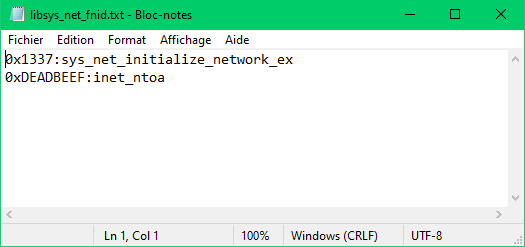
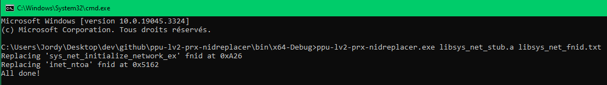

# ppu-lv2-prx-nidreplacer
 ps3 command line tool to replace stub libraries fnid's, reverse engineered from ppu-lv2-prx-exportpickup.exe (4.75 sdk).
 
## usage
`ppu-lv2-prx-nidreplacer.exe your_library_stub.a fnid_list.txt`

fnid list format must be fnid:symbol for each line, example:

demo:

## credits
- 3141card
- psdevwiki